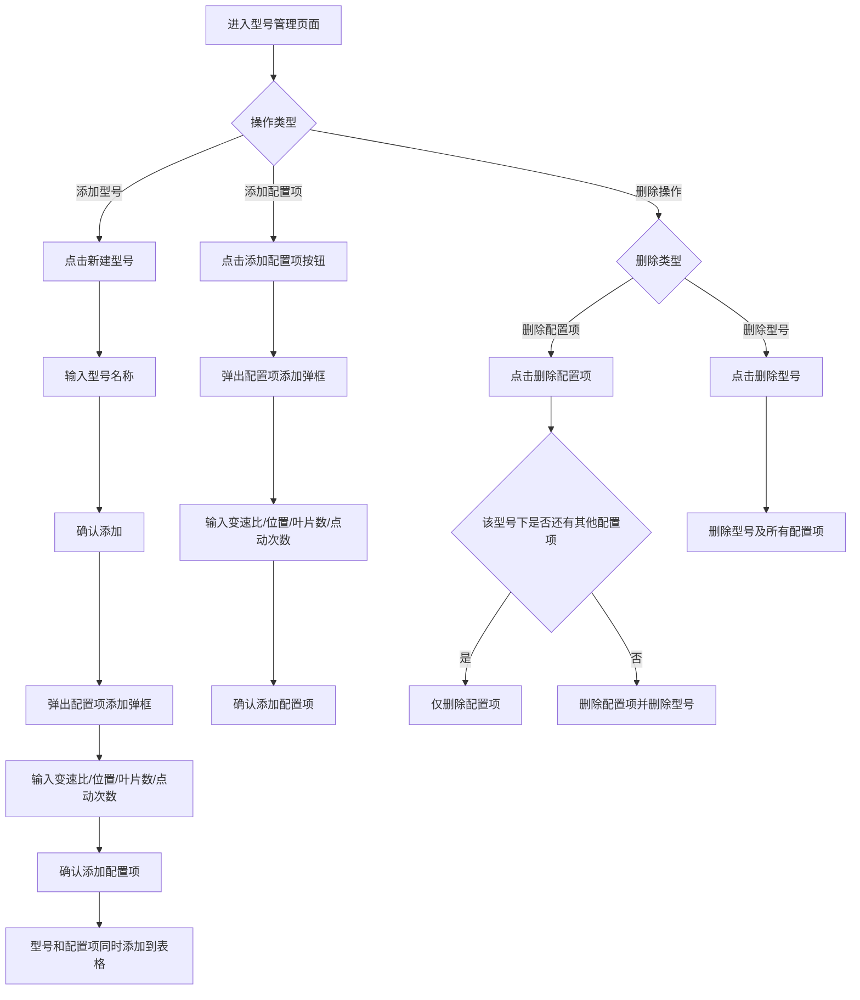
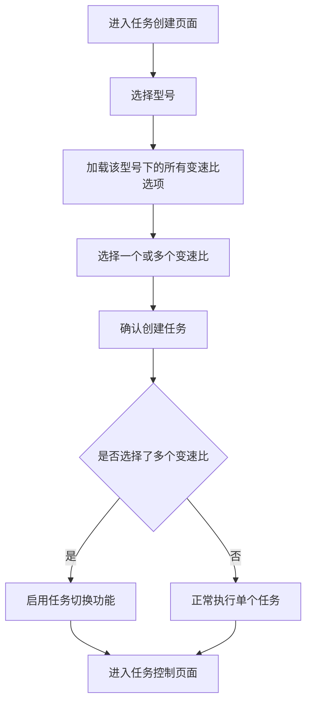
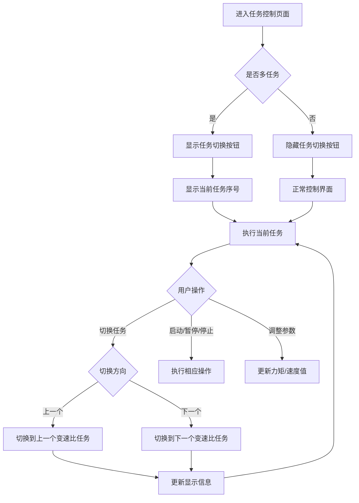

# 发动机设备控制系统 - 需求文档

## 1. 产品概述

本系统用于管理发动机型号配置信息，并支持创建和执行发动机控制任务。系统主要包含三个核心功能模块：
- 发动机型号管理模块
- 任务创建模块
- 任务控制执行模块

## 2. 功能需求详细说明

### 2.1 发动机型号管理页面

#### 2.1.1 页面布局
- **顶部显示区域**：显示当前选中的型号信息（格式：`型号 | 位置 | 模式`，例如：`CFM56-3B | LPC2-33/46 | 点动`）
- **设置按钮**：位于顶部右侧，用于配置当前选中型号的相关设置
- **新建型号按钮**：位于页面左侧，用于创建新的发动机型号
- **数据表格**：展示型号及其关联的配置信息

#### 2.1.2 数据字段定义
每个型号下包含以下配置项：
- **型号**（Model）：发动机型号，如 "WS-10"、"CFM56-3B" 等
- **变速比**（Gear Ratio）：新增字段，表示变速比数值
- **位置**（Position）：发动机位置标识，如 "LPC2-33/46"
- **叶片数**（Number of Blades）：叶片数量
- **点动次数**（Jog Count）：点动操作的次数

**数据关系说明**：
- 一个型号可以包含多个配置组合
- 每个配置组合包含：一个变速比 + 一个位置 + 一个叶片数 + 一个点动次数
- 这些字段是一对一的关系，即一个变速比对应唯一的位置、叶片数、点动次数

#### 2.1.3 功能操作

**添加型号**：
1. 点击"新建型号"按钮
2. 弹出输入框，输入型号名称
3. 确认后，立即弹出配置项添加弹框（必须至少添加一个配置项）
4. 在配置项添加弹框中输入：变速比、位置、叶片数、点动次数
5. 确认后，型号和第一个配置项同时添加到表格中

**添加配置项**：
1. 在表格底部，找到对应型号的"添加"行
2. 在"位置"、"叶片数"、"点动次数"列输入相应值
3. 在"变速比"列输入变速比值（新增字段）
4. 确认后，该配置项添加到该型号下
5. 取消则关闭弹框，不保存任何数据

**配置项添加弹框设计**：
- 弹框标题：显示"添加配置项"或"编辑配置项"（编辑场景）
- 弹框内容：包含四个输入字段（变速比、位置、叶片数、点动次数）
- 弹框底部：确认按钮、取消按钮
- 数据校验：所有字段必填，且必须为有效数值

**删除操作**：
- **删除配置项**：点击某条配置项的删除按钮，删除该条记录
  - 删除后，如果该型号下还有其他配置项，型号保留
  - 删除后，如果该型号下已无任何配置项，自动删除该型号
- **删除型号**：直接删除型号时，该型号下的所有配置项一并删除

#### 2.1.4 表格展示规则
- 同一型号的多个配置项，在"型号"列合并显示（垂直合并）
- 每个配置项独立显示一行，包含：变速比、位置、叶片数、点动次数
- 每行配置项提供"删除"按钮
- 每个型号提供"添加配置项"按钮，点击后弹出配置项添加弹框

### 2.2 创建发动机控制任务页面

#### 2.2.1 页面布局
- **标题**：显示"请输入型号与变速比"
- **输入表单**：包含两个输入字段

#### 2.2.2 字段定义
- **型号**（Model）：
  - 类型：下拉选择框（从已添加的型号中选择）
  - 限制：一次只能选择一个型号
- **变速比**（Gear Ratio）：
  - 类型：多选下拉框（从选中型号的配置项中选择）
  - 限制：可以选择多个变速比
  - **注意**：移除原有的"SN"字段和"数量"字段

#### 2.2.3 功能操作
1. 用户首先选择型号
2. 选择型号后，变速比下拉框显示该型号下所有可用的变速比选项
3. 用户可以选择一个或多个变速比
4. 确认创建任务

### 2.3 任务控制页面

#### 2.3.1 页面布局
- **顶部信息显示**：
  - 第一行：显示当前任务信息（格式：`型号 | 位置 | 模式`）
  - 第二行：显示"机力矩/速度"
- **控制按钮区域**：3x3网格布局的控制按钮

#### 2.3.2 按钮功能定义

**第一行按钮**：
- **启动/暂停**：开始或暂停当前任务
- **正转/反转**：控制旋转方向
- **点动/连续**：切换点动模式或连续模式

**第二行按钮**：
- **设置**：打开设置面板
- **停止**：停止当前任务
- **（移除自动拍照按钮）**

**第三行按钮**：
- **力矩+**：增加力矩
- **力矩-**：减少力矩
- **速度+**：增加速度
- **速度-**：减少速度

#### 2.3.3 多任务切换功能（新增）

**触发条件**：
- 当创建任务时选择了多个变速比时，启用任务切换功能

**功能说明**：
- **上一个任务**按钮：
  - 位置：建议放在第二行，替代"自动拍照"的位置，或新增一行
  - 功能：切换到上一个变速比任务
  - 显示规则：如果是第一个任务，按钮置灰或隐藏
- **下一个任务**按钮：
  - 位置：与"上一个任务"相邻
  - 功能：切换到下一个变速比任务
  - 显示规则：如果是最后一个任务，按钮置灰或隐藏

**任务切换逻辑**：
- 切换时，显示当前任务序号（如：任务 2/5）
- 切换时，更新顶部显示信息（型号、位置、模式等）
- 切换时，保持当前任务的执行状态（启动/暂停状态）
- 切换时，重置控制参数（力矩、速度等）为当前任务的默认值

## 3. 数据模型

### 3.1 型号配置数据模型

```
型号（Model）
├── 型号ID
├── 型号名称
└── 配置项列表（ConfigItems）
    ├── 配置项ID
    ├── 变速比（GearRatio）
    ├── 位置（Position）
    ├── 叶片数（BladeCount）
    └── 点动次数（JogCount）
```

### 3.2 任务数据模型

```
任务（Task）
├── 任务ID
├── 型号ID
├── 型号名称
└── 变速比列表（GearRatioList）
    ├── 变速比1
    ├── 变速比2
    └── ...
```

### 3.3 任务执行数据模型

```
任务执行（TaskExecution）
├── 执行ID
├── 任务ID
├── 当前变速比索引
├── 当前状态（启动/暂停/停止）
├── 当前力矩值
├── 当前速度值
└── 执行进度
```

## 4. 业务规则

### 4.1 型号管理规则
1. 型号名称不能重复
2. 新建型号时，必须至少添加一个配置项才能完成创建
3. 型号下必须至少有一个配置项才能被任务选择
4. 删除型号时，级联删除所有关联的配置项
5. 删除配置项时，如果型号下无配置项，自动删除型号

### 4.2 任务创建规则
1. 必须选择型号
2. 必须至少选择一个变速比
3. 选择的变速比必须属于所选型号

### 4.3 任务执行规则
1. 多个变速比任务按选择顺序执行
2. 任务切换时，需要保存当前任务的执行状态
3. 所有任务完成后，提示任务完成
4. 可以随时停止任务，停止后可以继续执行

## 5. 交互流程

### 5.1 型号管理流程



### 5.2 任务创建流程



### 5.3 任务执行流程



## 6. 界面修改清单

### 6.1 型号管理页面
- [ ] 在表格中新增"变速比"列
- [ ] 调整表格列顺序：型号 | 变速比 | 位置 | 叶片数 | 点动次数
- [ ] 实现新建型号时立即弹出配置项添加弹框（必须至少添加一个配置项）
- [ ] 实现添加配置项弹框功能（包含变速比、位置、叶片数、点动次数输入）
- [ ] 为每个型号添加"添加配置项"按钮
- [ ] 实现删除配置项后自动删除型号的逻辑

### 6.2 任务创建页面
- [ ] 移除"SN"字段
- [ ] 移除"数量"字段
- [ ] 将"SN"字段替换为"变速比"多选下拉框
- [ ] 修改标题文字为"请输入型号与变速比"
- [ ] 实现型号选择后动态加载变速比选项
- [ ] 实现变速比多选功能

### 6.3 任务控制页面
- [ ] 移除"自动拍照"按钮
- [ ] 新增"上一个任务"按钮（条件显示）
- [ ] 新增"下一个任务"按钮（条件显示）
- [ ] 实现任务切换逻辑
- [ ] 添加任务序号显示（如：任务 2/5）
- [ ] 实现切换时更新显示信息

## 7. 异常处理

### 7.1 数据校验
- 型号名称不能为空
- 新建型号时，必须至少添加一个配置项
- 变速比、位置、叶片数、点动次数必须为有效数值
- 任务创建时，必须选择有效的型号和变速比

### 7.2 边界情况
- 删除最后一个配置项时，自动删除型号
- 切换任务时，如果已是第一个/最后一个任务，按钮置灰
- 任务执行过程中切换任务，需要保存当前状态

### 7.3 错误提示
- 操作失败时，显示明确的错误提示信息
- 数据校验失败时，提示具体哪个字段不符合要求

## 8. 后续优化建议

1. **数据导入导出**：支持批量导入型号配置数据
2. **任务历史记录**：记录任务执行历史，支持查看和回放
3. **参数预设**：支持保存常用的力矩/速度参数组合
4. **任务模板**：支持将常用任务保存为模板，快速创建
5. **数据统计**：统计各型号的使用频率、任务完成情况等

---

**文档版本**：v1.0  
**创建日期**：2024  
**最后更新**：2024
